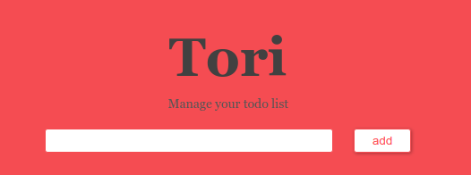

<p align="center">
  
</p>
<p align="center">
  <i>A simple todo-list app build with flask and mongodb.</i>
</p>

## Install
1. Ensure that mongodb is installed.
  ```bash
  $ sudo apt install mongodb
  ```
2. Install the dependencies.
  ```bash
  $ pip install -r requirements.txt
  ```
3. Run the app.
  ```bash
  $ flask run
  ```
4. Open [http://127.0.0.1:5000/](http://127.0.0.1:5000/) in your browser, and you'll see the app.

## Usage
- Add a todo: Simply write your todo in the text input area and click <span style="
    font-size:14px;
    padding: 5px 20px;
    border: 1px solid #ef5f5f;
    border-radius: 3px;
    background-color: #fff;
    color: #ff5f5f;
    box-shadow: 1px 1px 5px 0 rgba(0,0,0,0.30)">add</span> button.
  > All your todos are stored in collection 'todos' in database 'tori' in MongoDB.

- Edit a todo: Click <span style="
    display: inline-block;
    width: 30px;
    height: 30px;
    border-radius: 25px;
    overflow: hidden;
    background-color: #ff5f5f;
    text-align: center;
    line-height: 30px;
    font-size: 15px;
    font-family: arial;
    font-weight: 700;
    color: #fff;
    box-shadow: 1px 1px 0 0 rgba(0,0,0,0.2)">E</span> button at the right of the todo to edit it.

- Delete a todo: Click <span style="
    display: inline-block;
    width: 30px;
    height: 30px;
    border-radius: 25px;
    overflow: hidden;
    background-color: #ff5f5f;
    text-align: center;
    line-height: 30px;
    font-size: 24px;
    font-family: arial;
    font-weight: 700;
    color: #fff;
    box-shadow: 1px 1px 0 0 rgba(0,0,0,0.2)">×</span> button to delete the todo.

## TODOs
- [ ] Add more color themes.
- [ ] Export the todo-list.
- [ ] Add ranks of each todo item.

## LICENSE

Copyright (c) 2019 tishacy.
Licensed under the [MIT License](./LICENSE).
